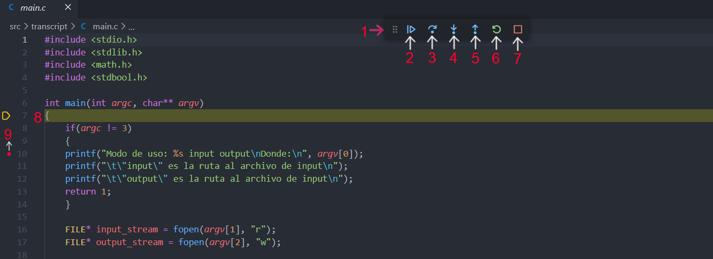

# Debugging En C

En esta guía se mostrara que es un debugger, cuando es útil y como configurarlo en VScode para Windows con WSL, Mac (con maquina virtual o Docker) y Linux.

## Que es un debugger

Muchas veces al programar se pueden encontrar problemas  y *bugs* donde nuestro programa no realiza lo que se esperaba o tiene problemas asociado a la gestion de memoria (como StackOverflow, SegmentationFault, Invalid Read, entre otros).
Para solucionar estos problemas la vía tradicional es el analizar los puntos frecuentes de fallas como un puntero no inicializado, un for sin condición de inicio o una recursión mal definida. Sin embargo muchas veces esto no soluciona nuestros problemas, o la complejidad del codigo es tal que dicha tarea involucraria un esfuerzo gigante en tiempo, Para esto se crearon los *debuggers*.

Un *debugger* es un tipo particular de programa que crea una instancia de ejecucion controlada para los programas a testear. Un simil a esto puede ser *valgrind* que es un memory debugger, crea una instancia de ejecucion para nuestro programa donde utilizando herramientas del SO puede verificar que la memoria sea liberada correctamente o tambien checkear en que parte del codigo es donde ocurren las operaciones que producen *SegmentationFault*.
Al poder crear estas instancias controladas de ejecucion, con un debugger podemos hacer (entre otras cosas):

- Analizar el comportamiento de nuestro programa linea por linea
- Poner puntos de interes donde deseamos que nuestro codigo se detenga para observar dicho instante (*breakpoints*)
- Ver el valor y estado de las variables definidas en un instante determinado
- Ver el *traceback* de alguna funcion en un instante dado (util para analizar recursiones o "errores de arrastre")
- Breakpoints condicionales (por ejemplo Si *x>n*, el debugger se detiene)

En C el *code debugger* mas utilizado es *gdb* (GNU debugger). El cual tiene implementaciones muy amigables al usuario al poder conectarlo con IDEs tales como VSCode, CLion, Atom, entre otros. En esta guia nos centraremos en VSCode, si deseas saber como integrarlo con tu IDE existen muchas en internet para realizarlo.

# Instalacion

## WSL y Linux

- Extension C/C++ en VSCode
- GDB instalado (en linux esta instalado por defecto y wsl tambien)
- En Windows, reabrir la carpeta con *Remote-WSL*

## MacOS

- Extension C/C++ en VSCode

# Guia de uso

Luego de instalar la extension C/C++ en VSCode, hemos de configurar el comportamiento de nuestro debugger. Para esto hemos de utilizar el archivo *.vscode/launch.json*, donde dejaremos la configuracion para debugear nuestro programa

Si es que no tienes la carpeta *.vscode* en tu entorno de desarrollo, debes crearla, al igual que el archivo *launch.json*.

Dentro del archivo *launch.json* ha de ir lo siguiente:

## WSL y Linux

```json
{
    // Generic C debug file for PUC IIC2133
    // by Carlos Paredes
    "version": "0.0.0",
    "configurations": [
        {
            "name": "GDB - Debug Executable",
            "type": "cppdbg",
            "request": "launch",
            "program": "${workspaceFolder}/Nombre_Ejecutable",
            "args": [Argumentos_Ejecucion],
            "stopAtEntry": true,
            "cwd": "${workspaceFolder}",
            "environment": [],
            "setupCommands": [
                {
                    "description": "Enable pretty-printing for gdb",
                    "text": "-enable-pretty-printing",
                    "ignoreFailures": true
                }
            ],
            "MIMode": "gdb",
            "miDebuggerPath": "/usr/bin/gdb"
        }
    ]
}
```

## MacOS

```json
{
    // Generic C debug file for PUC IIC2133 For MacOS with CLang
    // by Carlos Paredes
    "version": "0.0.0",
    "configurations": [
      {
        "name": "CLang - Debug Executable",
        "type": "cppdbg",
        "request": "launch",
        "program": "${workspaceFolder}/Nombre_Ejecutable",
        "args": [Argumentos_Ejecucion],
        "stopAtEntry": true,
        "cwd": "${workspaceFolder}",
        "environment": [],
        "externalConsole": false,
        "setupCommands": [
            {
                "description": "Enable pretty-printing for gdb",
                "text": "-enable-pretty-printing",
                "ignoreFailures": true
            }
        ],
        "MIMode": "lldb",
      }
    ]
  }
```

Esta es la configuracion basica para la funcionalidad del debugger, las 2 partes que deberas cambiar son los valores en *program* y en *args*.

***program***: En program tienes que poner la ruta al *ejecutable* generado al hacer *make*, si tu ejecutable se llama *programa*, entonces deberia ir lo siguiente

```json
"program": "${workspaceFolder}/programa"
```

***args***: aca van los argumentos del programa, por ejemplo si para ejecutar el programa sobre cierto input realizas

``` sh
programa input.txt output.txt d 100
```

En args deberia ir lo siguiente:

```json
"args": ["input.txt", "output.txt", "d", "100"]
```

*Nota: Para tareas con visualizador, si deseas debugear recuerda agregar el argumento que oculta el visualizador (--novis)*

Si desearas debugear otro input como *input2.txt*, en esa lista has de realizar el cambio.

### Uso

gdb ya esta configurado si creaste el archivo launch.json, ahora si apretas *F5* o vas a la barra superior a la opcion *Run -> Start Debugging*, el debugger comenzara a ejecutarse, En ese momento veras que VSCode te lleva a la primera linea del programa en *main*



Hay ciertas cosas interesantes a notar de la imagen

   1. Barra de herramientas para debugear
   2. Boton Continue: Avanza al proximo breakpoint
   3. Next: avanza a la siguiente linea
   4. Step Into: Al estar sobre el llamado a una funcion, entra a la funcion
   5. Step Out: Sale de la función
   6. Reload: Reinicia el debugger
   7. Stop: Termina la ejecucion
   8. Linea Destacada: La linea que el programa esta ejecutando
   9. Punto al lado de los numeros: Breakpoint

Muchas de estas son autoexplanatorias, sin embargo hay que mencionar un concepto clave para debugear, los breakpoints.

**Breakpoint**: Lugares en el codigo donde deseas que el debugger se detenga, GDB ademas da la opcion de crear Conditional Breakpoints, donde das una condicion para que el programa se detenga cuando alguna condicion se cumpla.

Para setear un breakpoint tienes que clickear al lado izquierdo de numero de linea.
